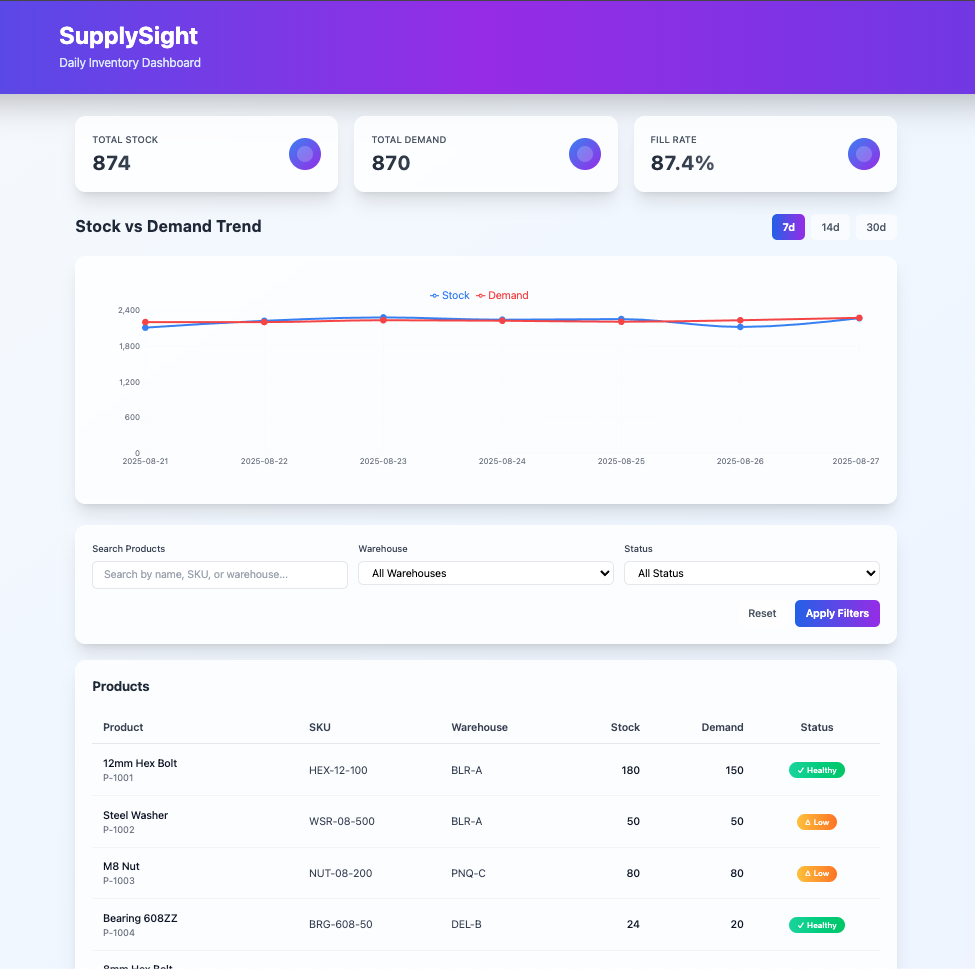
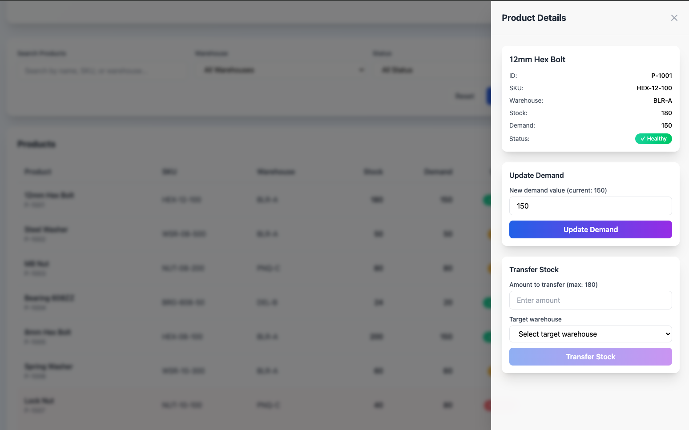
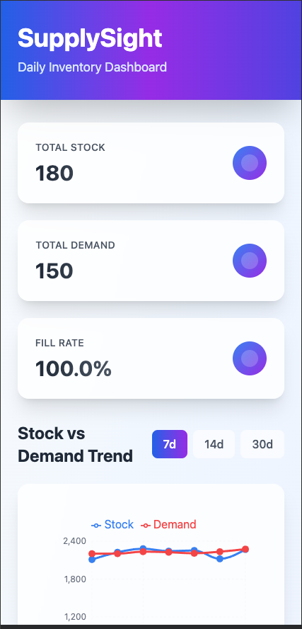
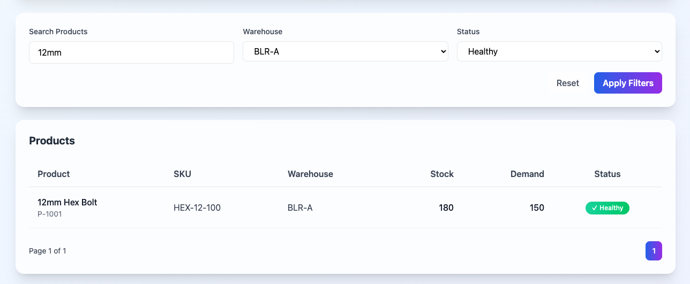
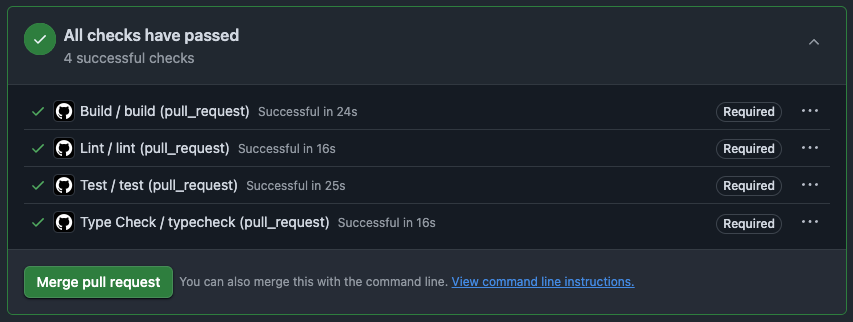

# SupplySight Dashboard

A production-ready Daily Inventory Dashboard built with React, TypeScript, and GraphQL. This project demonstrates modern web development practices with a focus on clean architecture, excellent developer experience, and real-world quality gates.

## 🚀 Features

- **React 18 + TypeScript + Tailwind CSS** - Modern, type-safe UI development
- **GraphQL API** - Mock server with Apollo Yoga for realistic data operations
- **Real-time Dashboard** - Live KPI cards, trend charts, and product management
- **Advanced Filtering** - Search, warehouse, and status-based filtering
- **Interactive Product Management** - Update demand and transfer stock operations
- **Responsive Design** - Mobile-first approach with Tailwind CSS
- **Production Ready** - Error handling, loading states, and accessibility

## 📸 Screenshots

### Main Dashboard

*Main dashboard view with KPI cards, filters, and product table*

### Product Details Drawer

*Product details drawer with update demand and transfer stock functionality*

### Mobile Responsive View

*Responsive design optimized for mobile devices*

### Filtered Results

*Dashboard with active filters showing critical stock items*

### GitHub PR Checks

*GitHub Actions CI/CD checks that must pass before merging to main branch*

## 📊 Dashboard Features

### KPI Cards
- **Total Stock** - Sum of all product stock levels
- **Total Demand** - Sum of all product demand
- **Fill Rate** - Calculated as `sum(min(stock, demand)) / sum(demand) * 100%`

### Product Status System
- 🟢 **Healthy** - Stock > Demand
- 🟡 **Low** - Stock = Demand  
- 🔴 **Critical** - Stock < Demand (with red row highlighting)

### Interactive Features
- **Live Filtering** - Search by name, SKU, or ID
- **Warehouse Filtering** - Filter by specific warehouses
- **Status Filtering** - Filter by product status
- **Product Details Drawer** - Click any row to view details and perform actions
- **Stock Operations** - Update demand and transfer stock between warehouses

## 🛠️ Tech Stack

### Frontend
- **React 18** - UI framework
- **TypeScript** - Type safety
- **Tailwind CSS** - Utility-first styling
- **Apollo Client** - GraphQL client with normalized cache
- **TanStack Router** - Type-safe routing
- **Recharts** - Data visualization
- **Vite** - Build tool and dev server

### Backend
- **Node.js 22+** - Runtime
- **GraphQL Yoga** - GraphQL server
- **Pino** - Structured logging
- **TypeScript** - Type safety

### Development
- **Vitest** - Unit testing
- **React Testing Library** - Component testing
- **Playwright** - E2E testing
- **ESLint** - Code linting
- **Prettier** - Code formatting

## 🚀 Quick Start

### Prerequisites
- Node.js 22+ 
- npm

### Installation

1. **Clone the repository**
   ```bash
   git clone https://github.com/aliyousafzai183/SupplySight.git
   cd SupplySight
   ```

2. **Install dependencies**
   ```bash
   npm install
   ```

3. **Set up environment variables**
   ```bash
   # Create .env file in apps/web/
   echo "VITE_GRAPHQL_URL=http://localhost:4000/graphql" > apps/web/.env
   ```

4. **Start development servers**
   ```bash
   npm run dev
   ```

5. **Open your browser**
   - Frontend: http://localhost:5173
   - GraphQL Playground: http://localhost:4000/graphql

### 🧪 Testing
```bash
# Run all tests
npm run test

# Run specific test suites
npm run test:unit    # Unit tests only
npm run test:watch   # Watch mode for development
```

## 📁 Project Structure

```
supply-sight/
├── apps/
│   ├── web/                    # React frontend
│   │   ├── src/
│   │   │   ├── app/
│   │   │   │   ├── components/ # Reusable UI components
│   │   │   │   └── routes/     # Page components
│   │   │   ├── features/       # Feature-based organization
│   │   │   │   └── products/   # Product domain
│   │   │   └── lib/           # Utilities and config
│   │   └── ...
│   └── server/                 # GraphQL API
│       ├── src/
│       │   ├── resolvers/      # GraphQL resolvers
│       │   ├── data/          # Seed data
│       │   └── ...
│       └── ...
└── ...
```

## 🧪 Testing

The project includes comprehensive testing with 191 tests covering all components and utilities:

```bash
# Run all tests
npm run test

# Unit tests only
npm run test:unit

# Watch mode for development
npm run test:watch

# Type checking
npm run typecheck

# Linting
npm run lint
```

### Test Coverage
- ✅ **Components**: All UI components tested
- ✅ **Utilities**: Business logic and helper functions
- ✅ **GraphQL**: Queries and mutations
- ✅ **Integration**: Complex workflows and data flows
- ✅ **Accessibility**: ARIA labels and keyboard navigation

## 🏗️ Building for Production

```bash
# Build both apps
npm run build

# Start production servers
npm start
```

## 🔧 Development Scripts

### Root Level
- `npm run dev` - Start development servers (web + server)
- `npm run build` - Build both apps for production
- `npm run start` - Start production servers
- `npm run test` - Run all tests

### Web App (apps/web/)
- `npm run dev` - Start Vite dev server
- `npm run build` - Build for production
- `npm run preview` - Preview production build
- `npm run test:unit` - Run unit tests
- `npm run test:watch` - Run tests in watch mode
- `npm run lint` - Run ESLint
- `npm run typecheck` - Run TypeScript compiler

### Server App (apps/server/)
- `npm run dev` - Start development server with hot reload
- `npm run build` - Build for production
- `npm start` - Start production server

## 📊 Sample Data

The application comes with 25 sample product entries across multiple warehouses:

- **BLR-A Warehouse**: 12mm Hex Bolt, Steel Washer, M6 Screw, etc.
- **PNQ-C Warehouse**: M8 Nut, Aluminum Plate, Copper Wire, etc.
- **DEL-B Warehouse**: Bearing 608ZZ, Steel Rod, Plastic Gasket, etc.
- **MUM-D Warehouse**: Rubber Seal, Ceramic Capacitor, etc.

Each product includes realistic stock and demand values to demonstrate the status calculation logic.

## 🔒 Security & Performance

- **Input Validation** - Zod schemas for form validation
- **CORS Protection** - Configured for production domains
- **Rate Limiting** - API protection
- **Optimistic Updates** - Snappy UI interactions
- **Error Boundaries** - Graceful error handling
- **Accessibility** - ARIA labels and keyboard navigation

## 🚀 Deployment & CI/CD

### GitHub Actions Workflows
- **`lint.yml`** - ESLint checking on PRs
- **`typecheck.yml`** - TypeScript compilation verification
- **`test.yml`** - Unit test execution
- **`build.yml`** - Production build verification
- **`delete-branch.yml`** - Automatic branch cleanup after merge

**All checks must pass before merging to main branch** - See screenshot above for the required checks interface.

### Vercel Deployment
The application is designed for deployment on Vercel with:

- **Environment Variables** - Secure configuration management
- **Build Optimization** - Vite for fast builds
- **CDN Integration** - Static asset optimization
- **Preview Deployments** - Automatic PR deployments
- **Production Deployments** - Automatic main branch deployments

### Environment Configuration
```bash
# Development
VITE_GRAPHQL_URL=http://localhost:4000/graphql
VITE_SENTRY_DSN=

# Production
VITE_GRAPHQL_URL=https://your-api-domain.com/graphql
VITE_SENTRY_DSN=https://your-sentry-dsn
```

## 📝 License

MIT License - see LICENSE file for details.

## 🤝 Contributing

1. Fork the repository
2. Create a feature branch
3. Make your changes
4. Add tests
5. Submit a pull request

## 📋 Project Status

### ✅ Completed Features
- [x] React 18 + TypeScript + Tailwind CSS setup
- [x] GraphQL API with Apollo Yoga
- [x] Complete dashboard UI with all components
- [x] KPI cards (Total Stock, Total Demand, Fill Rate)
- [x] Interactive product table with filtering and pagination
- [x] Stock vs Demand line chart
- [x] Product status system (Healthy/Low/Critical)
- [x] Product details drawer with mutations
- [x] URL-based filter persistence
- [x] Comprehensive test suite (191 tests)
- [x] GitHub Actions CI/CD workflows
- [x] Production-ready build configuration
- [x] Environment variable management
- [x] Error handling and loading states
- [x] Accessibility features

### 🎯 Assignment Requirements Met
- ✅ React + Tailwind project
- ✅ Mock GraphQL server
- ✅ Dashboard layout with top bar and date range chips
- ✅ KPI cards with correct calculations
- ✅ Line chart for stock vs demand trends
- ✅ Filters row with search, warehouse, and status dropdowns
- ✅ Products table with all specified columns
- ✅ Status pills with correct business logic
- ✅ Pagination (10 rows/page)
- ✅ Live filter updates
- ✅ Row click opens drawer with product details
- ✅ Update Demand and Transfer Stock mutations
- ✅ NOTES.md with technical decisions and trade-offs

---

Built with ❤️ using modern web technologies by Ali Said
